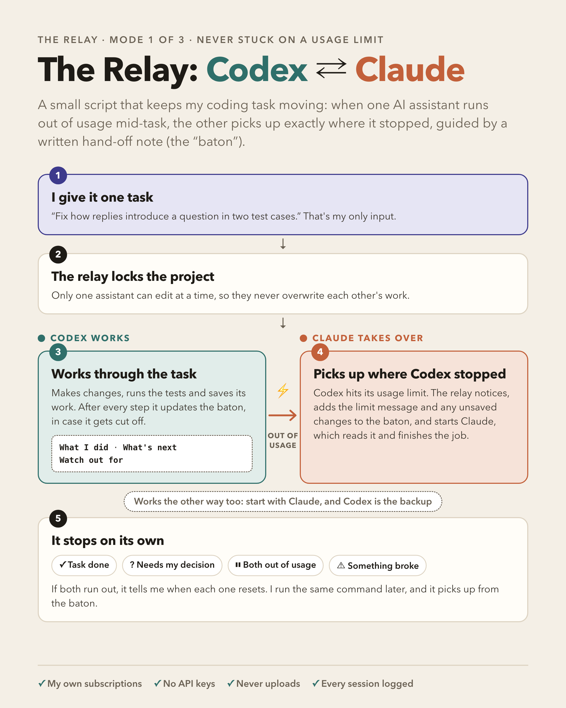
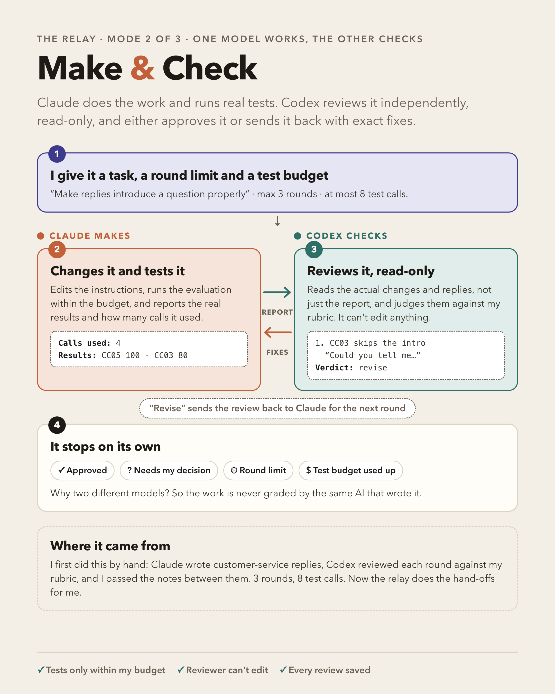
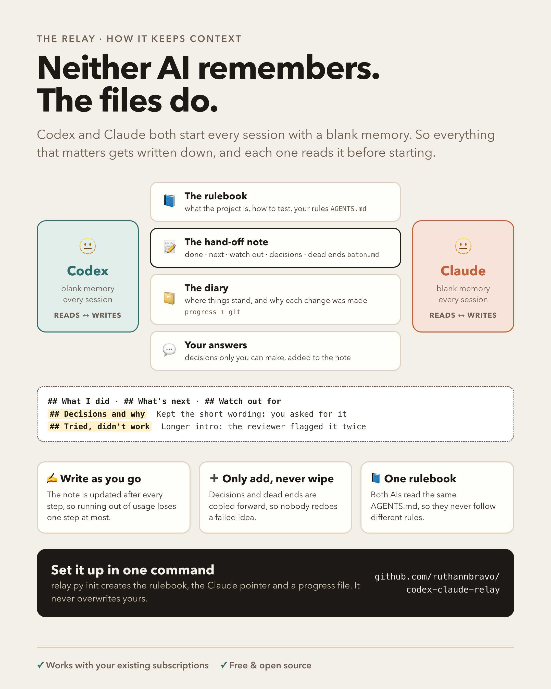
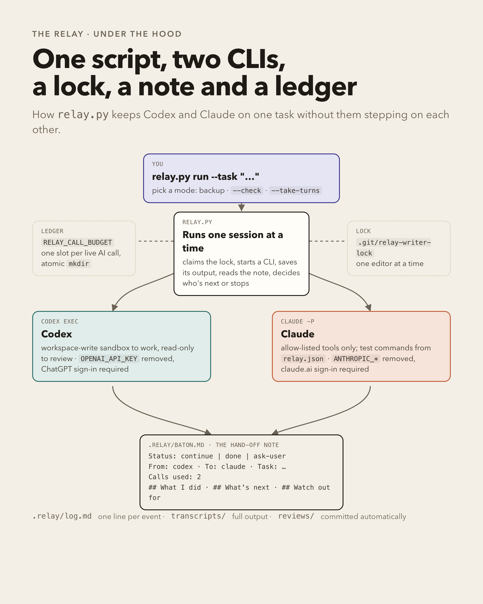
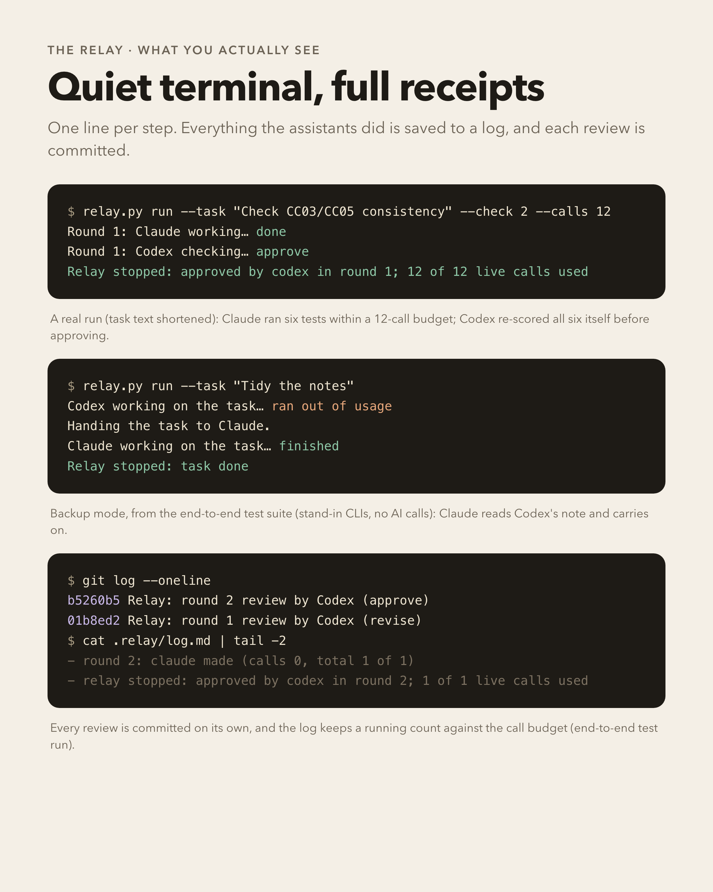
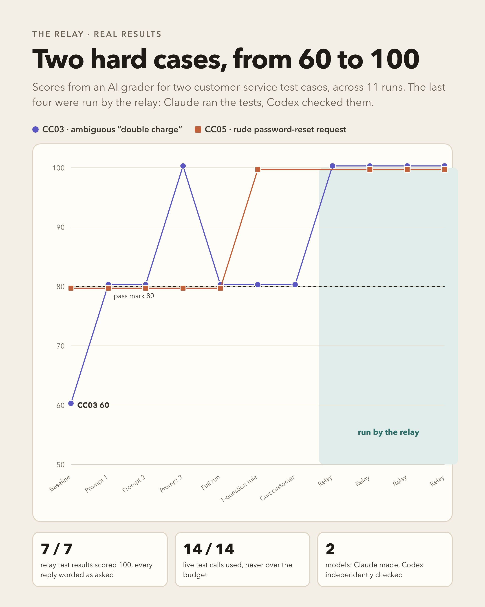
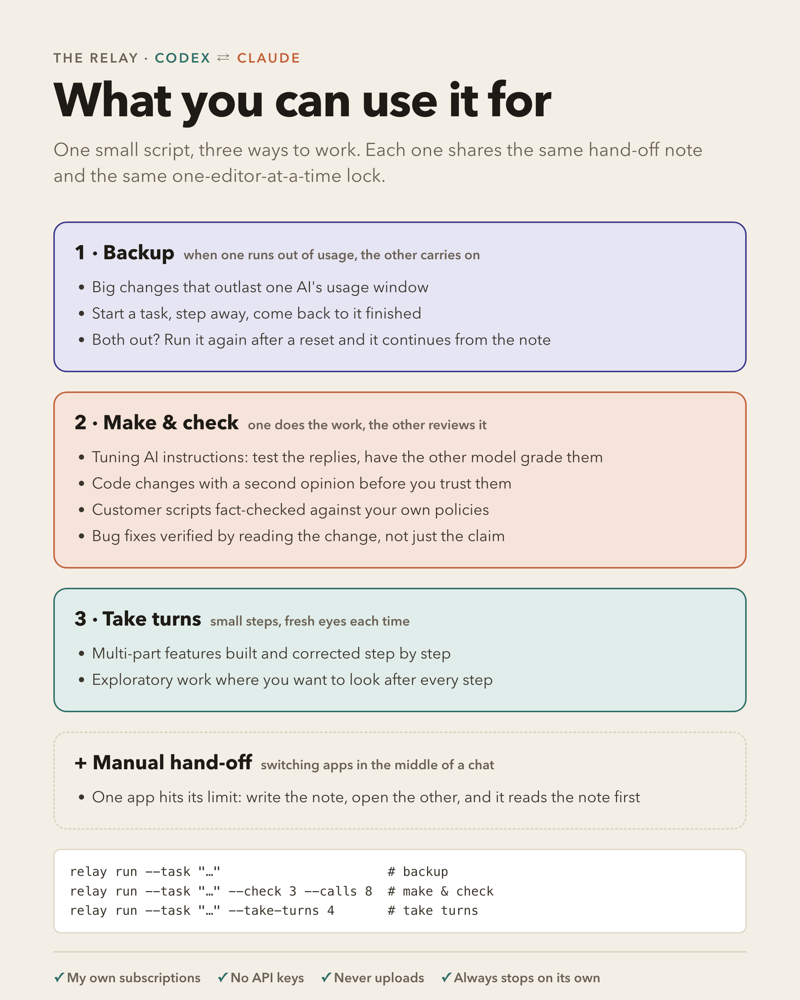

# Codex ⇄ Claude relay

A small Python script that lets two AI coding assistants, OpenAI's **Codex** and Anthropic's **Claude**, work on the same task in the same Git repository. They take turns through a written hand-off note, so neither one starts from scratch and you don't have to re-explain the task.



## Three modes

| Mode | Command | What happens | Stops when |
| --- | --- | --- | --- |
| **Backup** (default) | `relay.py run --task "..."` | One assistant works through the whole task, updating the note as it goes. If it runs out of usage, the relay records that and starts the other one, which picks up from the note. `--start claude` swaps who goes first. | Done · needs you · both out of usage (it prints both reset times) · any other error |
| **Make and check** | `relay.py run --task "..." --check 3 --calls 8` | Each round Claude does the work and may run live tests within the call budget. Codex then reviews it read-only and ends with approve, revise or ask-user. "Revise" goes back to Claude with the review. | Approved · needs you · round limit (1–5) · call budget exceeded or misreported · any error |
| **Take turns** | `relay.py run --task "..." --take-turns 4` | They alternate, one focused step each. | Done · needs you · turn limit (1–8) · any error |

Plus `relay.py init` to set up a project, `relay.py pass --to codex --task "..." --note "..."` to hand off by hand at the end of a normal chat, `relay.py status` to see who's working and the current note, and `--dry-run` on any `run` to see exactly what each assistant would be told, with no calls.



## How it keeps context

Codex and Claude each start every session with a blank memory. Neither can see the other's conversation. So the relay never relies on memory: everything that matters is written into files that both of them read first. Think of a shift change at a hospital. The next nurse doesn't remember the last shift, but the patient's chart says everything.



| Layer | File | What it holds | Changes |
| --- | --- | --- | --- |
| **Rulebook** | `AGENTS.md` (Codex reads it automatically) plus a one-line `CLAUDE.md` pointing to it | What the project is, how to test it, rules, your preferences | Rarely |
| **Task note** | `.relay/baton.md` | What I did · What's next · Watch out for · **Decisions and why** · **Tried, didn't work** | After every step |
| **Diary** | your progress file plus Git commit messages | Where things stand across days, and why each change was made | Every session |
| **Your answers** | added to the task note with `relay.py pass --note "..."` | Decisions only you can make | When asked |

Rules that keep it from leaking:

- **Write as you go.** Assistants update the note after every meaningful step, not just at the end, so running out of usage loses at most one step.
- **Only add, never wipe.** "Decisions and why" and "Tried, didn't work" are copied forward every time. Hand-overs and `pass` add to the existing note instead of replacing it, and if an assistant stops without writing anything, the relay keeps the old note and adds what it can see (the limit message and any half-finished files).
- **One rulebook for both.** Put shared instructions in `AGENTS.md`. Codex reads it automatically, and a one-line `CLAUDE.md` sends Claude there, so the two never follow different rules.
- **Keep the start-up reading short.** Every session re-reads its notes from scratch, and that reading counts toward your usage. The relay's own additions are small (about 500 tokens of instructions plus the note). The risk is your own files growing. In the project this was built in, the notes every session read first had grown to about 55,000 tokens; moving the history into an archive and keeping a one-page "where things stand" brought that down to about 1,900. Keep `AGENTS.md` and your progress file to roughly a page each, and point to longer records instead of including them.
- **A second pair of eyes.** In make and check, the reviewer judges the work against your own files (`review_criteria`), which catches drift from what you asked.

`relay.py init` sets all of this up in a new project: a starter `AGENTS.md` to fill in, the `CLAUDE.md` pointer, a progress file, `relay.json` and the `.gitignore` entry. It never overwrites a file you already have.

What doesn't carry over: anything that was said but never written down. If it matters, put it in `AGENTS.md` or the note.

## Avoiding groupthink

When one AI reads another's notes, it tends to see the problem the same way, agree too easily and miss what the first one missed. The relay pushes back on that:

- **Blind review (make and check, on by default).** Before the reviewer sees the other AI's report, the relay moves the report out of the project and the reviewer looks at the work on its own. Then it gets its blind findings back, reads the report, and has to list what only it found, what only the other found, and where they disagree, re-checking each against the code. Agreement between two AIs doesn't count as evidence. Both passes are saved in the review. `--no-blind` skips the extra look (cheaper, more anchoring).
- **Decisions say who made them.** Each line under "Decisions and why" starts with `[user]`, `[codex]` or `[claude]`. Yours are final. An AI's can be challenged, but only with evidence, and the old line is kept and marked as replaced. Record yours with `relay.py pass --to claude --note "..." --decision "Keep the short wording"`.
- **Checked or assumed.** Every claim in the note is marked `(checked: how)` or `(assumed)`, and the next AI must check anything assumed before relying on it. Earlier notes are leads, not facts.
- **Two different models.** Codex and Claude come from different companies with different blind spots, and they're judged against your files and real tests, not each other's opinion.
- **Swap who goes first.** Whoever starts sets the frame: use `--start claude` or `--maker codex` on some runs.

## How it works



- **One editor at a time.** Every session claims a lock in the Git directory (`.git/relay-writer-lock`). If anyone else holds it, the relay refuses to start.
- **The hand-off note.** `.relay/baton.md` says what was done, what's next, what to watch out for, which decisions were made and why, and what was tried and didn't work. Its `Status:` line (`continue`, `done` or `ask-user`) decides whether the relay continues.
- **The call ledger.** Every session gets a `RELAY_CALL_BUDGET` directory. Your test runner calls `reserveRelayCall()` (Node) or `reserve_relay_call()` (Python) from [`budget/`](budget/) before each live model call. Each call takes one slot with an atomic `mkdir`, so repeated and parallel runs share one cap. Outside make and check the budget is zero. In make and check the relay also checks the maker's reported `Calls used:` against the ledger and stops if they disagree.
- **Usage-limit detection.** When a session ends, the relay looks for a usage-limit message in its last few lines only, so text the assistant read earlier can't trigger a switch.
- **Receipts.** The terminal shows one line per step. Everything each assistant printed goes to `.relay/transcripts/`, `.relay/log.md` keeps a one-line history, and each make-and-check review is committed on its own.



## Set up

You need Python 3.9+, Git, and both CLIs signed in with their subscriptions: [Codex CLI](https://github.com/openai/codex) (`codex login`, ChatGPT sign-in) and [Claude Code](https://docs.claude.com/en/docs/claude-code) (`claude`, claude.ai sign-in).

```sh
curl -O https://raw.githubusercontent.com/ruthannbravo/codex-claude-relay/main/relay.py
python3 relay.py init          # creates AGENTS.md, CLAUDE.md, a progress file and relay.json; never overwrites
python3 relay.py run --task "Describe the job" --dry-run
```

Optionally add `relay.json` at your repository root (see [`relay.example.json`](relay.example.json)):

| Key | Meaning | Default |
| --- | --- | --- |
| `notes` | Files each assistant reads first | `AGENTS.md`, `CLAUDE.md`, `README.md` (those that exist) |
| `checkpoint` | Progress file to keep up to date | none |
| `tests` | Test commands; Claude is allowed to run exactly these | none |
| `live_command` | The only command allowed to make live model calls (needed for `--calls`) | none |
| `review_criteria` | Files the reviewer judges against | the `notes` |
| `claude_model` / `codex_model` | Model for each CLI | `sonnet` / the CLI's default |

Add `.relay/transcripts/` to your `.gitignore`.

## Guardrails

- **Subscriptions only.** Claude runs with `ANTHROPIC_*` and provider overrides removed and must be signed in with claude.ai. Codex runs with `OPENAI_API_KEY` removed and must be signed in with ChatGPT. There is no API-key fallback.
- **It always ends.** Nothing retries, loops forever or runs on a schedule. Backup mode uses at most one session of each assistant per run.
- **Reviewers can't edit.** Codex reviews in its read-only sandbox, and Claude reviews with read-only tools.
- **No publishing.** Assistants are told never to push, and the relay stops if one switches branch.
- **Know the limits.** The ledger guards test runners that call it. It isn't a sandbox against deliberate changes to code or environment. Codex's workspace-write sandbox usually can't make Git commits, so it leaves changes for the next assistant and says so in the note.

## Results so far



Built while improving a customer-service AI prototype. Make and check was run live twice: once on one test case (2 of 2 calls), then on two hard test cases three times each (12 of 12 calls). All seven results scored 100, and Codex re-checked every score itself before approving. Take turns was also run live. Backup mode is covered by the end-to-end tests, but a real usage-limit hand-over hasn't happened yet. If you see one, the exact limit message in `.relay/transcripts/` is the useful thing to report.

## Tests

```sh
python3 -m unittest discover tests
```

The tests run the real relay end to end in a throwaway Git repository against stand-in `codex` and `claude` programs ([`tests/fake_agent.py`](tests/fake_agent.py)), with no model calls.



## License

MIT
