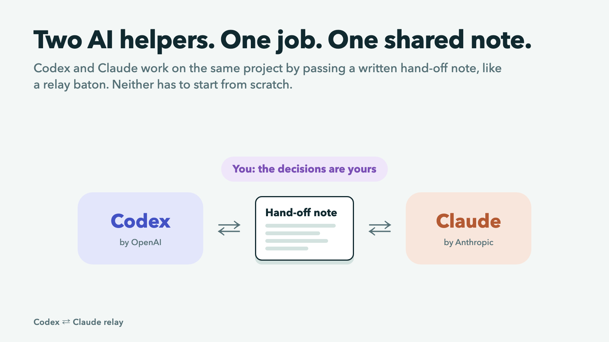
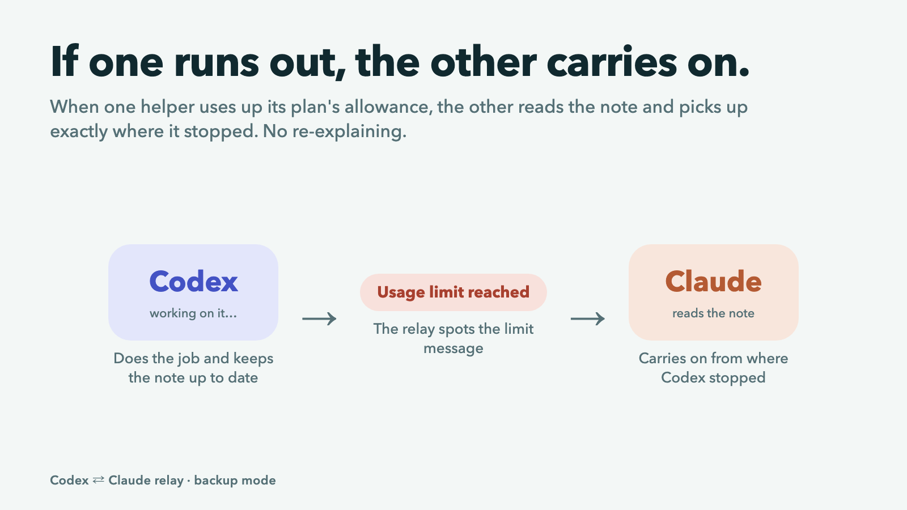
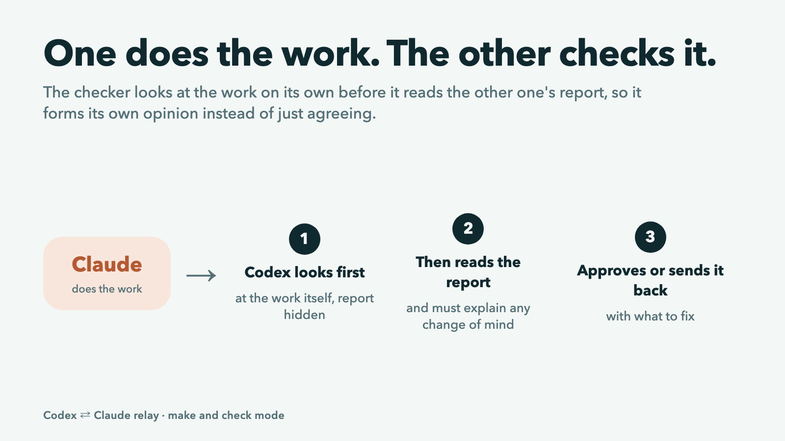
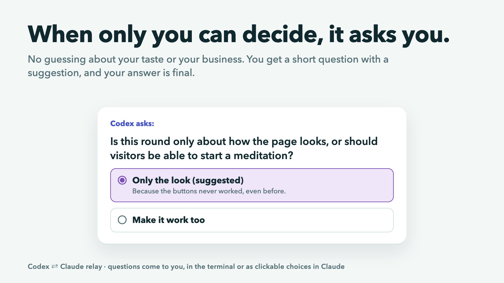
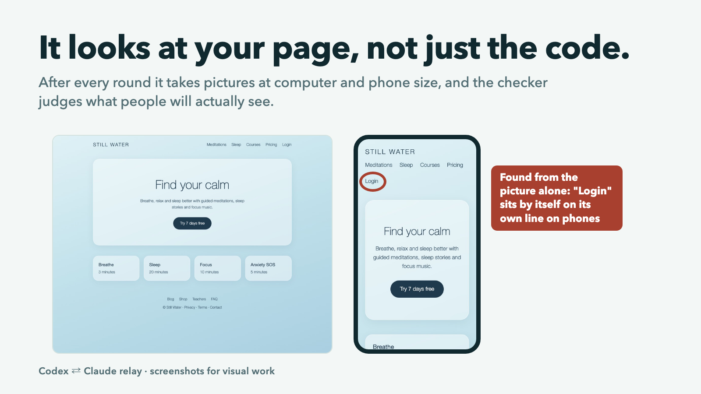
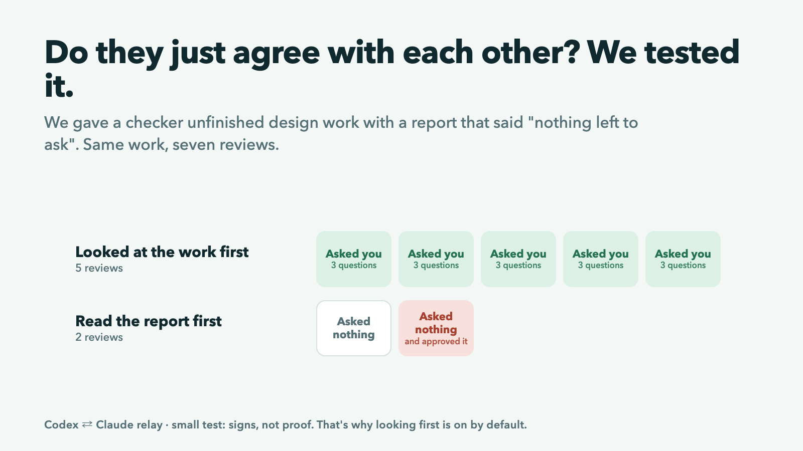
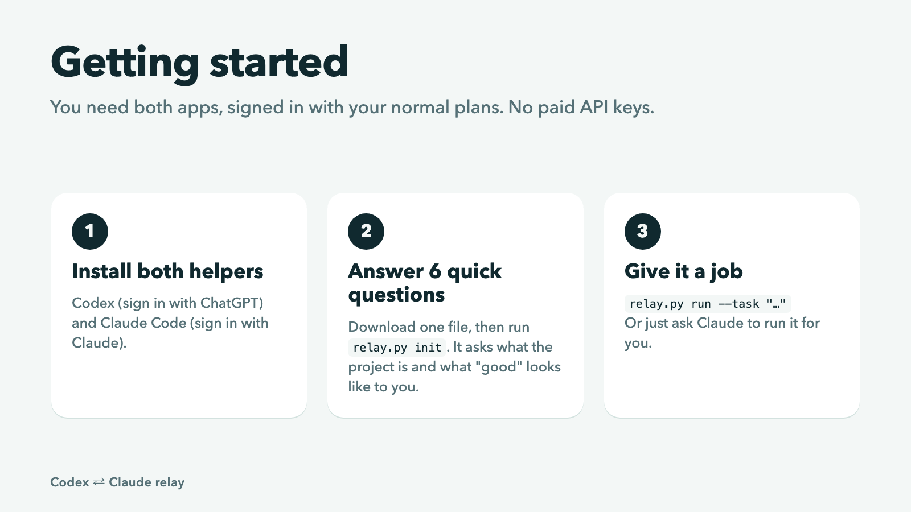

# Codex ⇄ Claude relay

Let two AI coding helpers, **Codex** (by OpenAI) and **Claude** (by Anthropic), work on the same project together. They pass a written note back and forth, like runners passing a baton, so neither starts from scratch and you never have to re-explain the job.



## What it does

**If one runs out of usage, the other carries on.** Both helpers come with usage limits (hourly, daily or weekly). When one hits its limit mid-job, in any mode, the other reads the note and picks up where it stopped.



**One does the work, the other checks it.** The checker looks at the work on its own first, before it reads the other one's report. That way it forms its own opinion instead of just agreeing.



**When only you can decide, it asks you.** Your taste, your goals, facts about your business: the helpers ask instead of guessing. You get a short question with a suggested answer, and your answer is final.



**It looks at your page, not just the code.** For websites and apps, it takes pictures at computer and phone size after each round, and the checker judges what people will actually see.



**We tested whether they just agree with each other.** When the checker read the other one's report first, it sometimes stopped asking questions and even approved unfinished work. When it looked first, it kept its own view every time. So looking first is on by default. [Read the tests](docs/tests.md).



## Install

**Easiest: ask your AI.** In Claude or Codex, say:

> Install the relay from github.com/ruthannbravo/codex-claude-relay and set it up for this project.

It installs the relay, then asks you 6 quick questions about your project.

**Or paste this one line into Terminal:**

```sh
curl -fsSL https://raw.githubusercontent.com/ruthannbravo/codex-claude-relay/main/install.sh | sh
```

Either way you need [Codex](https://github.com/openai/codex) and [Claude Code](https://docs.claude.com/en/docs/claude-code) installed and signed in with your normal plans. Install the relay once and it works in every project.



## Using it

| What you want | Say to Claude or Codex | Or type in Terminal |
| --- | --- | --- |
| Set up a project (once per project: 6 quick questions) | "Set up the relay for this project." | `relay init` |
| Give it a job | "Use the relay to make the home page calmer." | `relay run --task "Make the home page calmer"` |
| One does the work, the other checks it | "Use the relay with checking to make the home page calmer." | `relay run --task "..." --check 2` |
| See where things stand | "What's the relay up to?" | `relay status` |
| Answer its questions later | The AI asks you directly | `relay answer` |
| Update to the latest version | "Update the relay." | run the install line again |
| Remove it | "Uninstall the relay." | `relay uninstall` |

**Claude** shows the relay's questions as clickable choices. **Codex** lists them in the chat and you type your answers. Codex may ask your permission the first time it runs the relay, because the relay starts both apps and Codex's safety settings usually block that.

## Common questions

**Does it cost extra?** No. It uses the Codex and Claude plans you already pay for. It never uses paid API keys, even if you have one set up.

**Is my project safe?** Only one helper can change files at a time. The checker can't edit anything. The helpers are told never to publish or upload your work: that stays your decision.

**Do I need to be a programmer?** No. You can ask Claude or Codex to install it, set it up and run it for you. Everything the helpers ask you is in plain English.

**How do I use it on another project?** Open that project and say "Set up the relay for this project" (or type `relay init`). It asks the 6 questions again for that project, because each project has its own goals and taste. You only install once.

**What does it not do?** It doesn't run on a schedule or loop forever: every run ends, and it tells you why. And it only knows what's written down, so anything that matters should be in your answers or the project notes.

## Instructions for AI assistants

If a user asks you to install or use this relay, follow these steps.

1. **Check what's needed.** `codex --version` and `claude --version` must work, signed in with subscriptions (`codex login status` mentions ChatGPT; `claude auth status` shows claude.ai). If either is missing, tell the user how to install or sign in. Never set up API keys for the relay.
2. **Install:** `curl -fsSL https://raw.githubusercontent.com/ruthannbravo/codex-claude-relay/main/install.sh | RELAY_TEACH=no sh`. It needs network access; if your sandbox blocks it, ask the user to approve running it. It prints where the `relay` command is; use that full path if `relay` isn't found in your shell yet.
3. **Ask the user** whether to add a short note about the relay to Claude's and Codex's general instructions, so "set up the relay" works in any project. If yes, run `relay teach`.
4. **Set up the project.** In the project folder, run `relay init` (if the folder isn't a Git repository, ask the user, then run `git init` first). Without a keyboard it lists 6 questions: ask the user each one (with your question tool if you have one; they may skip any), then run `relay init --answer "..."` once per question, in order (`""` for a skipped one).
5. **Running jobs.** `relay run --task "..."`, or with `--check 2` so one makes and the other checks. Runs can take a while, so run them in the background if you can. If it stops with questions for the user, read `.relay/questions.json`, ask each (the suggested answer first, with its reason), then run `relay answer --answer "..."` once per question, in order (`suggested` and `skip` work too). The run carries on by itself.

---

## For developers

A single Python file with no dependencies. It runs the `codex` and `claude` CLIs in your Git repository and coordinates them through files.

### Modes

| Mode | Command | What happens | Stops when |
| --- | --- | --- | --- |
| **Backup** (default) | `relay.py run --task "..."` | One assistant works through the whole task, updating the note as it goes. If it runs out of usage, the relay records that and starts the other one, which picks up from the note. `--start claude` swaps who goes first. | Done · waiting for your answers · both out of usage (prints both reset times) · any other error |
| **Make and check** | `relay.py run --task "..." --check 3 --calls 8` | Each round the maker (Claude, or `--maker codex`) does the work and may make live test calls within the budget. The checker reviews read-only, blind first, and ends with approve, revise or ask-user. | Approved · waiting for your answers · round limit (1–5) · call budget exceeded or misreported · any error. If the maker runs out of usage, the other finishes the job alone (and it tells you how to get it checked later). |
| **Take turns** | `relay.py run --task "..." --take-turns 4` | They alternate, one focused step each. | Done · waiting for your answers · turn limit (1–8) · any error. If one runs out of usage, the other finishes alone. |

Other commands: `init` (set up a project and ask the 6 questions; run it again to change your answers; without a keyboard it lists them and takes `--answer` once per question), `answer` (answer waiting questions, then carry on), `look` (screenshot your pages), `status` (who holds the lock, and the current note), `pass --to codex --task "..." --note "..." [--decision "..."]` (hand off by hand at the end of a normal chat). `teach [--remove]` (add or remove the relay note in Claude's and Codex's general instructions), `uninstall`, `version`. Add `--dry-run` to any `run` to print exactly what each assistant would be told, with no model calls.

Without installing, the same file also runs as `python3 relay.py ...` from inside a project; `install.sh` just keeps one copy in `~/.relay` and adds a `relay` command (in `~/.local/bin`, added to your shell's PATH if needed).

### How context is kept

Each session starts with a blank memory, so everything that matters lives in files both assistants read first:

| Layer | File | What it holds |
| --- | --- | --- |
| Rulebook | `AGENTS.md` (Codex reads it automatically) and a `CLAUDE.md` pointing to it | What the project is, your setup answers, how to test it, rules |
| Task note | `.relay/baton.md` | What I did · What's next · Watch out for · Decisions and why · Tried, didn't work · Questions for you |
| Diary | your progress file and Git commit messages | Where things stand across days |

Notes are only added to, never wiped: decisions and dead ends are copied forward on every hand-off, and if an assistant stops without writing, the relay keeps the old note and adds what it can see. Keep `AGENTS.md` and your progress file to about a page each, since every session re-reads them and that reading counts toward your usage.

### Against groupthink

- **Blind first look** (make and check, on by default). The report and the maker's unsaved notes are set aside while the checker reviews the work alone. It then reads the report and lists what only it found, what only the maker reported, and any disagreements. A "Changed my mind" section must give new evidence for every finding it dropped. `--no-blind` skips this.
- **Decisions say who made them.** `[user]`, `[codex]` or `[claude]`. Yours are final; an assistant's can be challenged only with evidence, and the old line is kept.
- **Checked or assumed.** Every claim is marked `(checked: how)` or `(assumed)`. Anything assumed about what you want becomes a question for you.
- **Two different models,** judged against your files and real tests rather than each other's opinion. Swap who goes first with `--start` or `--maker`.

### Questions for you

Assistants list what only you can settle under "Questions for you": at most 3, in plain English, each with a suggested answer and a reason. In make and check, the maker's questions wait for the review, so both assistants' questions come in one stop. At a keyboard you answer in the terminal and the run carries on. Otherwise the relay saves them to `.relay/questions.json` and stops; `relay.py answer` asks them later, or takes `--answer "..."` once per question (`suggested` and `skip` work too) and resumes. Answers are recorded as `[user]` decisions, and assistants are told never to suggest undoing one.

### Seeing the page

Set `"look": ["index.html"]` (files or URLs) in `relay.json`. After each round of work the relay screenshots each page at 1280px and 390px wide into `.relay/screenshots/`. Claude reviewers open them; Codex reviewers get them attached with `--image`. The maker can run `relay.py look` itself. Needs Chrome or Chromium (or `RELAY_CHROME`). Pages that refuse to load in a frame get no phone picture.

### Settings (`relay.json`, optional)

See [`relay.example.json`](relay.example.json).

| Key | Meaning | Default |
| --- | --- | --- |
| `notes` | Files each assistant reads first | `AGENTS.md`, `CLAUDE.md`, `README.md` (those that exist) |
| `checkpoint` | Progress file to keep up to date | none |
| `tests` | Test commands; Claude may run exactly these, as maker or reviewer | none |
| `live_command` | The only command allowed to make live model calls (needed for `--calls`) | none |
| `review_criteria` | Files the reviewer judges against | the `notes` |
| `blind_hide` | Extra write-up files to set aside during the blind look | none |
| `claude_model` / `codex_model` | Model for each CLI | `sonnet` / the CLI's default |
| `look` | Pages to screenshot at desktop and phone size | none |
| `lock_name` | Name of the writer lock in the Git directory, to share your project's own lock | `relay-writer-lock` |
| `keep_chats` | Also save each session as a chat in the apps (sessions are kept separate so the blind look stays blind) | `false` |

Add `.relay/transcripts/` and `.relay/screenshots/` to your `.gitignore` (`init` adds the first).

### Under the hood

- **One editor at a time.** Every session claims a lock directory in the Git directory; if anyone else holds it, the relay refuses to start.
- **Call ledger.** Every session gets a `RELAY_CALL_BUDGET` directory. Your test runner calls `reserveRelayCall()` (Node) or `reserve_relay_call()` (Python) from [`budget/`](budget/) before each live model call; each call takes a slot with an atomic `mkdir`, so parallel runs share one cap. Outside make and check the limit is zero. The maker's reported `Calls used:` must match the ledger.
- **Usage-limit detection** reads only the last lines of a session, so a file that mentions limits can't trigger a switch.
- **Subscriptions only.** Claude runs with `ANTHROPIC_*` and provider overrides removed and must be signed in with claude.ai; Codex runs with `OPENAI_API_KEY` removed and must be signed in with ChatGPT.
- **Always ends.** No retries, schedules or endless loops; round, turn and question-stop limits.
- **Receipts.** One line per step in the terminal; full output in `.relay/transcripts/`; a one-line history in `.relay/log.md`; each review committed on its own.
- **Know the limits.** The ledger guards test runners that call it; it isn't a sandbox against deliberate changes. Codex's sandbox usually can't make Git commits, so it leaves changes for the next assistant and says so in the note.

### Tests

```sh
python3 -m unittest discover tests
```

51 end-to-end tests (including the installer, in a throwaway home folder) run the real relay in a throwaway Git repository against stand-in `codex` and `claude` programs ([`tests/fake_agent.py`](tests/fake_agent.py)), with no model calls. The README images are made from [`docs/images/source/cards.html`](docs/images/source/cards.html).

## License

MIT
